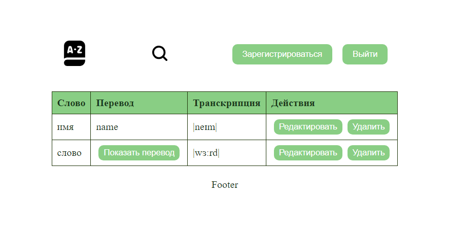
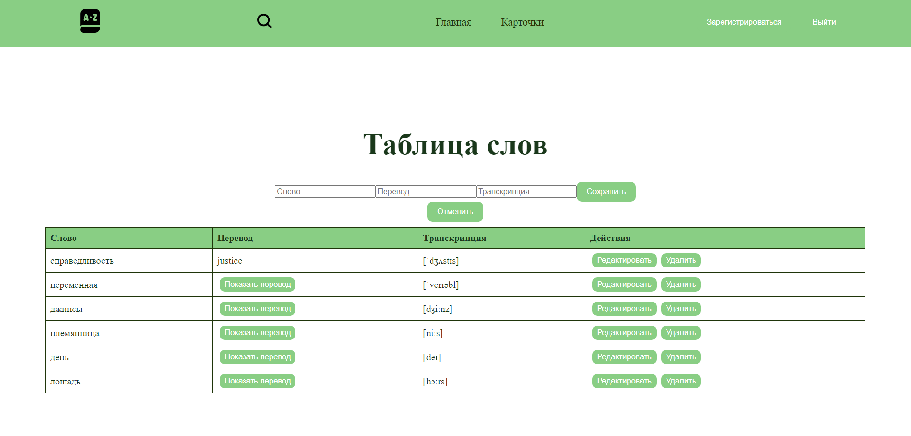

# Приложение для изучения иностранных слов по карточкам

Главная страница, где отображаются списки слов и карточек, а также режим тренировки.

У каждого слова есть основное значение, перевод, транскрипция. Есть возможность добавления слов.

По умолчанию перевод всегда скрыт. При нажатии на кнопку "Показать перевод", появляется перевод слова, а кнопка исчезает.

Условный рендеринг для полей таблицы: отображаются либо поля для чтения с кнопками "редактировать/удалить", либо поля ввода с кнопками "отмена редактирования/сохранить".

Анимация наведения, фокуса и нажатия на все элементы взаимодействия с пользователем (кнопки, формы и т.д.).

<a href="https://vitejs.dev/">Документация</a> Vite.

# Технологии React + Vite

  
 

 
   
  
  

